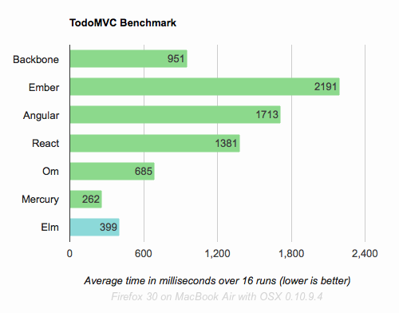

# try-elm

**What is elm?**
 - Elm is a functional programming language that compiles to JavaScript and runs in the browser.


**Elm online editor**
http://elm-lang.org/try

**Elm Packages**
http://package.elm-lang.org/


**Who created Elm?**

Evan Czaplicki originally designed Elm as his thesis in 2012 and currently works full time on Elm at Prezi. He's a bright, friendly guy who keeps his eye on the big picture while understanding all the details. I instantly liked Evan and continue to be impressed by the care he takes with this language. [Elm thesis](http://elm-lang.org/papers/concurrent-frp.pdf)


**Is the HTML rendering fast?**

http://elm-lang.org/blog/blazing-fast-html



### Setup

- [Elm Installer](http://elm-lang.org/install)
- NodeJS
- npm

```
elm make --version
node --version
npm --version
```

## Simple Elm apps

### [Hello World](/hello_world)
Hello World using ``elm-package install evancz/elm-html``.

Compiler option:

```
elm make --warn HelloWorld.elm --output index.html
```

Reactor option:

```
elm reactor -a=localhost -p=9000
```

### [Calling Functions](/calling_functions)
### [Defining Functions](/defining_functions)
